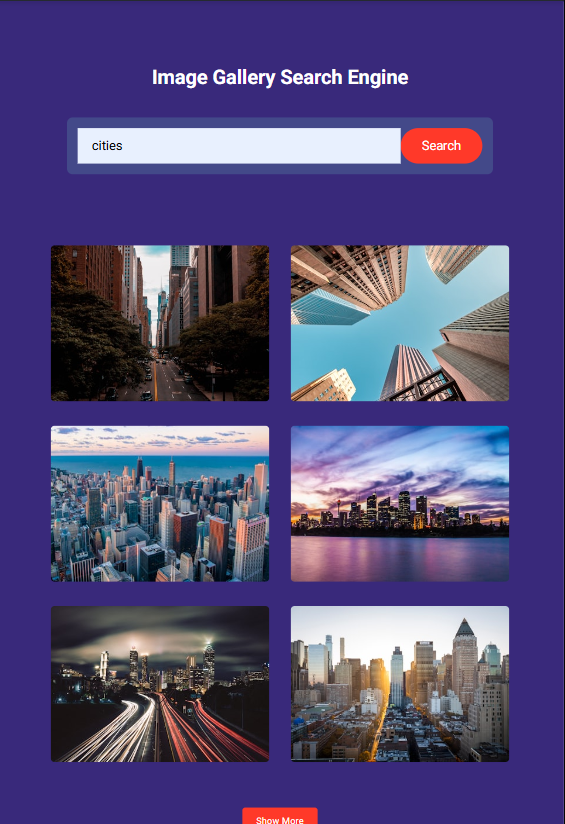

<div align="center">
  <h1 align="center">Interactive Image Gallery Website</h1>
  <br />
    <a>
      
    </a>
  <br />
</div>

## <a name="tech-stack">⚙️ Tech Stack</a>

- HTML
- CSS
- JavaScript

## <a name="features">🔋 Features</a>

👉 Responsive design with CSS and Flexbox/Grid

👉 Micro Interactions

👉 Mobile optimized experience

**Cloning the Repository**

```bash
git clone https://github.com/Semalgn/Image-gallery-project.git
cd image-gallery-project
```

**Running the Project**
```bash
start index.html with liveserver 
```
🚀 Feel free to contact me!
